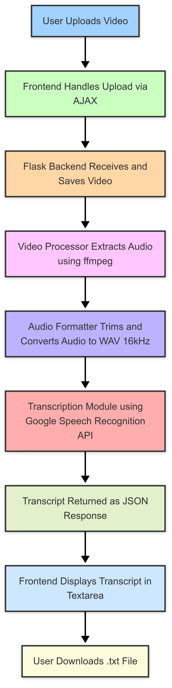
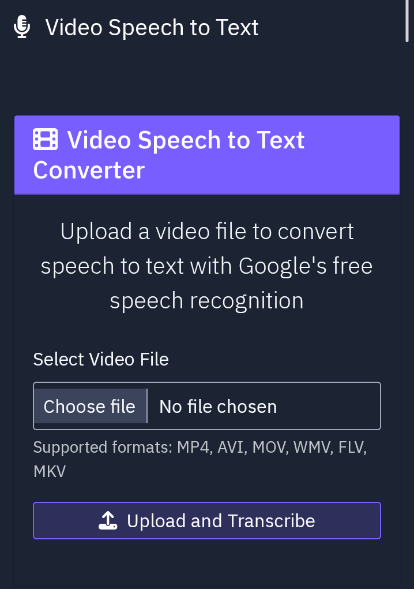

# SpeechTranscriber AI - Real-Time Speech-to-Text System

Real-time speech-to-text web application that converts audio and video speech into readable text using OSpeechTranscriber AI is a web-based application that converts spoken words from video or audio files into accurate, readable text in real time.
The system extracts audio from uploaded media files, processes it using speech recognition models, and generates a transcript that can be viewed or downloaded by the user.

This project demonstrates the integration of speech recognition, audio preprocessing, and web-based interaction to build an intelligent transcription tool.penAI Whisper API.

# Project Overview

Speech-to-text technology is widely used for transcription, accessibility, and automated documentation.
SpeechTranscriber AI simplifies this process by allowing users to upload video or audio files through a web interface and receive a generated transcript within seconds.

The system uses a Flask backend, speech recognition APIs, and audio processing tools to create a seamless transcription workflow.

## Features

- Upload video or audio files for transcription
- Automatic audio extraction using ffmpeg  
- Speech recognition using Whisper API  
- Real-time transcription display  
- Download transcript as .txt file  

## Tech Stack

### Backend

- Python
- Flask
- OpenAI Whisper API / Speech Recognition API
- FFmpeg

### Frontend

- HTML
- CSS
- JavaScript
- Bootstrap

### Audio Processing

- PyAudio
- pydub
- ffmpeg

## System Architecture

<p align="center">
  
</p>

## Processing Pipeline

The system follows a multi-stage pipeline to convert speech from video files into readable text.

1. **Video Upload**
   - The user uploads a video file through the web interface.

2. **Frontend Request**
   - The frontend sends the video to the Flask backend using an AJAX request.

3. **Video Processing**
   - The backend receives and stores the uploaded video.
   - Audio is extracted from the video using **FFmpeg**.

4. **Audio Preprocessing**
   - The extracted audio is converted to **WAV format (16kHz)** to ensure compatibility with speech recognition models.

5. **Speech Recognition**
   - The processed audio is sent to the **Whisper Speech Recognition API** to generate the transcript.

6. **Transcript Generation**
   - The recognized speech is returned as structured **JSON data**.

7. **Frontend Display**
   - The transcript is displayed dynamically in the web interface.

8. **Export Option**
   - Users can download the generated transcript as a `.txt` file.

## Demo

### Upload Interface
<p align="center">
  
</p>

## Applications

SpeechTranscriber AI system can be used in several real-world scenarios where automated speech-to-text conversion is required:

- **Lecture Transcription**
  - Convert recorded lectures or educational videos into text for easier studying and note-taking.

- **Meeting Documentation**
  - Automatically generate transcripts for business meetings, conferences, or discussions.

- **Content Creation**
  - Help content creators convert spoken video content into text for blogs, subtitles, or articles.

- **Accessibility Support**
  - Assist hearing-impaired individuals by converting spoken content into readable text.

- **Media Archiving**
  - Convert video archives such as interviews or documentaries into searchable text records.

- **Podcast and Video Captioning**
  - Generate subtitles or captions for podcasts, YouTube videos, or online courses.

## Installation

#### Clone the repository:

```bash
git clone https://github.com/yourusername/SpeechTranscriber-AI.git
cd SpeechTranscriber-AI
```

#### Install dependencies:

```bash
pip install -r requirements.txt
```

#### Install FFmpeg (required for audio extraction):

```bash
sudo apt install ffmpeg
```

or download it from the official website.

## Running the Application

#### Start the Flask server:

```bash
python app.py
```

#### Open the application in your browser:

```bash
http://127.0.0.1:5000
```
